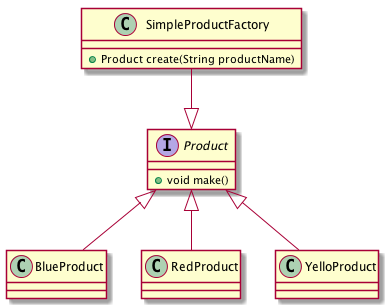

= 1-Simple Factory Pattern

Simple Factory Pattern is not in GOF design pattern categories.

简单工厂类只提供了一个创建实例的方法来实现创建者和创建对象的分离。
同样对于工厂类来说几乎无可避免的会有较多的创建逻辑，这个是简单工厂的缺点之一。

== 1.1 关于简单工厂模式的一个示意图

== 1.2 关于简单工厂模式的实现

//:sourcedir: ../../dp-demos/src/main/java
//include:: {sourcedir}/io/hedwig/dp/demos/creation/Product.java

[source,java]
.Product
----
public interface Product {
  void make();
}
----
.BlueProduct
----
public class BlueProduct implements Product {

  @Override
  public void make() {
    System.out.println("this is Blue");
  }
}
----
.RedProduct
----
public class RedProduct implements Product {

  @Override
  public void make() {
    System.out.println("this is RED");
  }
}
----
.YelloProduct
----
public class YellowProduct implements Product {

  @Override
  public void make() {
    System.out.println("this is Yellow");
  }
}
----
.SimpleProductFactory
----
public class SimpleProductFactory {

  static Map<String, Class> productMapping = Maps.newHashMap();

  static {
    productMapping.put("blue", BlueProduct.class);
    productMapping.put("red", RedProduct.class);
    productMapping.put("Yellow", YellowProduct.class);
  }

  /**
   * Create Product
   * @param productName
   * @return
   */
  public static Product create(String productName) {
    Class productClass = productMapping.getOrDefault(productName.toLowerCase(),RedProduct.class);

    try {
      return (Product) productClass.newInstance();
    } catch (InstantiationException | IllegalAccessException e) {
      e.printStackTrace();
      return new RedProduct();
    }
  }

  public static void main(String[] args) {

    Product product = SimpleProductFactory.create("BLUE");
    product.make();
  }
}
----

