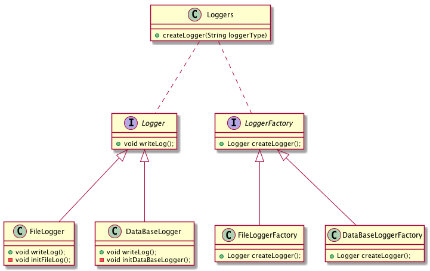

= 2- Factory-Method Pattern

Factory Method Pattern 也叫工厂模式，由子类决定创建那个实例.
这个的优点(比较SimpleFactory而言)是可以将复杂的创建逻辑放到子类进行实现

工厂模式主要优点是：

- 客户端所需要的细节通过不同的Factory被隐藏
- 多态设计
- 在添加新的子产品时可能无需改变任何客户端代码就可以实现

工厂模式主要缺点是：

== 2.1 关于工厂方法的一个示意图

== 2.2 工厂方法的实现

[source,java]

.Logger: Logger 接口
----
public interface Logger {
  public void writeLog();
}
----

.DatabaseLogger: DatabaseLogger 实现
----
public class DatabaseLogger implements Logger {

  @Override
  public void writeLog() {
    System.out.println("this is DatabaseLogger");
  }
}
----
.FileLogger: FileLogger 实现
----
public class FileLogger implements Logger {

  @Override
  public void writeLog() {
    System.out.println("this is FileLogger");
  }
}
----
.LoggerFactory: LoggerFactory 接口
----
public interface LoggerFactory {
  Logger createLogger();
}
----
.DatabaseLoggerFactory： DatabaseLoggerFactory 实现
----
public class DatabaseLoggerFactory implements LoggerFactory {

  @Override
  public Logger createLogger() {
    return new DatabaseLogger();
  }
}
----

.FileLoggerFactory: FileLoggerFactory 实现
----
public class FileLoggerFactory implements LoggerFactory {

  @Override
  public Logger createLogger() {
    return new FileLogger();
  }
}
----
.Loggers： Logger创建的客户端
----
public class Loggers {

  private static Map<String, Class> factories = new ConcurrentHashMap<>();

  static {
    factories.put(LoggerType.DB.name(), DatabaseLoggerFactory.class);
    factories.put(LoggerType.FILE.name(), FileLoggerFactory.class);
  }

  public static Logger createLogger(String loggerName) {
    LoggerFactory factory;
    try {
      factory = (LoggerFactory) factories.getOrDefault(loggerName, FileLoggerFactory.class)
          .newInstance();
    } catch (InstantiationException | IllegalAccessException e) {
      e.printStackTrace();
      factory = new FileLoggerFactory();
    }

    return factory.createLogger();

  }

  public static enum LoggerType {
    DB, FILE;
  }
}
----

=== 扩展

在实际的项目中，都是根据配置文件(xml或者property文件)或者annotation来决定创建什么实例