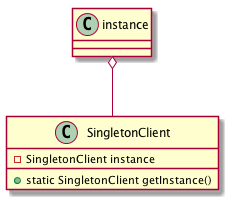

= 4- singleton Pattern
singleton 模式是提供了一种在一个应用中只允许一个实例的解决方法，使用非常广泛。

== 4.1 关于单例的一个示意图

== 4.2 单例的实现

此实现例子中通过synchronized关键字来保证一个实例被创建.
IntelliJ IDEA 中可以直接通过创建Singleton文件来创建类.

[source,java]
.SingletonClient
-----
public class SingletonClient {

  private static SingletonClient ourInstance = new SingletonClient();
  private static Object object = new Object();

  public static SingletonClient getInstance() {
    return ourInstance;
  }

  private SingletonClient() {
  }

 /**
   * lazy initialization,actually need double check
   */
  public static SingletonClient getInstanceLock() {
    synchronized (object) {
      if (ourInstance == null) {
        synchronized (SingletonClient.class){
          if(ourInstance==null){
            ourInstance = new SingletonClient();
          }
        }

      }
    }
    return ourInstance;
  }
}
-----

=== 4.2 单例的enum实现

[source,java]
.EnumSingleton
----
public enum EnumSingleton {
  INSTANCE;

  @Override
  public String toString() {
    return getDeclaringClass().getCanonicalName() + "@" + hashCode();
  }
}
----

=== 4.3 单例的nested class实现

[source,java]

.InitializingOnDemandHolder
----
public final class InitializingOnDemandHolder {

  /**
   * Private constructor.
   */
  private InitializingOnDemandHolder() {}

  /**
   * @return Singleton instance
   */
  public static InitializingOnDemandHolder getInstance() {
    return HelperHolder.INSTANCE;
  }

  /**
   * Provides the lazy-loaded Singleton instance.
   */
  private static class HelperHolder {
    private static final InitializingOnDemandHolder INSTANCE =
        new InitializingOnDemandHolder();
  }
}
----