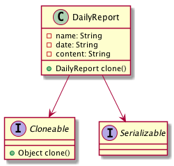

= 5- prototype Pattern

prototype使用的场景一般就是clone一个对象, 在创建对象消耗比较大的时候会采用此模式.
同时clone有浅copy和deepcopy两种，deepcopy一般用来复制内嵌的对象，实现deepclone比较复杂.

== 5.1 关于原型的一个示意图

== 5.2 原型的实现

[source,java]
.DailyReporter
----
public class DailyReporter implements Cloneable,Serializable {
  private String name;
  private String date;
  private String content;
  private Attachment attachment = new Attachment();

  /**
   *这个是浅拷贝，不会拷贝attachment
   * @return
   * @throws CloneNotSupportedException
   */
  @Override
  protected DailyReporter clone() throws CloneNotSupportedException {
    DailyReporter o = null;
    try{
      o=(DailyReporter)super.clone();
    }catch (CloneNotSupportedException e){
      System.out.println("Can't Clone for class "+this.getClass().getCanonicalName());
    }
    return o;

  }
  public DailyReporter deepclone() throws Exception{

    ByteArrayOutputStream bao=new ByteArrayOutputStream();
    ObjectOutputStream oos = new ObjectOutputStream(bao);
    oos.writeObject(this);
    ByteArrayInputStream bai = new ByteArrayInputStream(bao.toByteArray());
    ObjectInputStream osi=new ObjectInputStream(bai);
    return (DailyReporter)osi.readObject();
  }
 }
----
