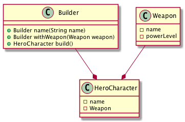

= 6- builder Pattern

构建者模式一般在生产的对象有比较复杂的内部结构时使用，比如对象内部属性
比较多，同时可能相互依赖，这是通过Builder这个类来负责创建
从而隔离客户类和构建者的复杂关系,使得构建过程代码可读性更好。

== 6.1 关于构建者的一个示意图

== 6.2 构建者的实现

[source,java]
.Weapong
----
@Data
public class Weapon {
  private String name;
  private int powerLevel;
}
----
.HeroCharacter
----
@ToString
@AllArgsConstructor
public class HeroCharacter {
  private String name;
  private final Weapon weapon;

  public HeroCharacter(Builder builder) {
    this.name=builder.name;
    this.weapon = builder.weapon;
  }

  public String getName() {
    return name;
  }

  public Weapon getWeapon() {
    return weapon;
  }
   @NoArgsConstructor
   public static class Builder{
    private Weapon weapon;
    private String name;

    public Builder name(String name){
      this.name=name;
      return this;
    }
    public Builder withWeapon(Weapon weapon){
      this.weapon=weapon;
      return this;
    }

    public HeroCharacter build(){
      return new HeroCharacter(this);
    }
   }
}
----
.HeroClient 通过构架者模式，代码可读性更好了
----
public class HeroClient {

  public static void main(String[] args) {

    HeroCharacter hc= new HeroCharacter.Builder().name("this")
        .withWeapon(new Weapon()).build();
    System.out.println(hc);
  }
}
----