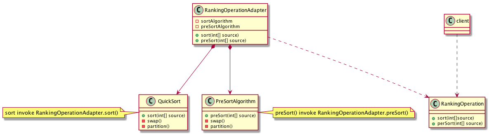

= 1- adapter Pattern
Adapter 模式用来

== 1.1 关于适配器的一个示意图

== 1.2 适配器的实现
:sourcedir: ../../dp-demos/src/main/java

[source,java]
.DefaultRankingOperation
----
include::{sourcedir}/io/hedwig/dp/demos/structural/adapter/DefaultRankingOperation.java[]
----
.PreSortAlgo
----
include::{sourcedir}/io/hedwig/dp/demos/structural/adapter/PreSortAlgo.java[]
----
.PreSorter
----
include::{sourcedir}/io/hedwig/dp/demos/structural/adapter/PreSorter.java[]
----
.QuickSort
----
include::{sourcedir}/io/hedwig/dp/demos/structural/adapter/QuickSort.java[]
----
.RankingOperation
----
include::{sourcedir}/io/hedwig/dp/demos/structural/adapter/RankingOperation.java[]
----
.RankingOperationAdapter
----
include::{sourcedir}/io/hedwig/dp/demos/structural/adapter/RankingOperationAdapter.java[]
----
.Sorter
----
include::{sourcedir}/io/hedwig/dp/demos/structural/adapter/Sorter.java[]
----
.SortClient
----
include::{sourcedir}/io/hedwig/dp/demos/structural/adapter/SortClient.java[]
----
