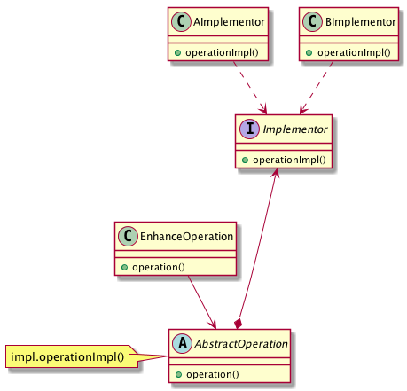

= 2- bridge Pattern

桥接模式是个非常使用的模式，用来连接两个或者多个不同纬度的继承关系.比如实际情况中可能会有：
- 报表展示
   * 周报
   * 日报
   * 月报
- 数据采集
   * 周数据采集
   * 日数据采集
   * 月数据采集

报表展示和数据采集就是通过桥接模式连接起来

== 2.1 关于桥接的一个示意图

== 2.2 桥接的实现
:sourcedir: ../../dp-demos/src/main/java
[source,java]
.AbstractOperation
----
include::{sourcedir}/io/hedwig/dp/demos/structural/bridge/AbstractOperation.java[]
----
.EnhancedOperation
----
include::{sourcedir}/io/hedwig/dp/demos/structural/bridge/EnhancedOperation.java[]
----
.Implementor
----
include::{sourcedir}/io/hedwig/dp/demos/structural/bridge/Implementor.java[]
----

.AImplementor
----
include::{sourcedir}/io/hedwig/dp/demos/structural/bridge/AImplementor.java[]
----

.BImplementor
----
include::{sourcedir}/io/hedwig/dp/demos/structural/bridge/BImplementor.java[]
----
