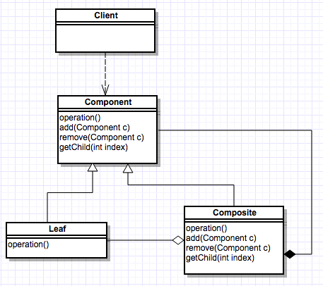

= 3- composite Pattern
composite模式可以用来组合对象形成某个具体的层次结构,比如说树形结构.组合模式组合了
整体-部分的关系。

== 3.1 关于组合的一个示意图

== 3.2 组合的实现
:sourcedir: ../../dp-demos/src/main/java
[source,java]

.Component
----
include::{sourcedir}/io/hedwig/dp/demos/structural/composite/Component.java[]
----

.Composite
----
include::{sourcedir}/io/hedwig/dp/demos/structural/composite/Composite.java[]
----

.Lea
----
include::{sourcedir}/io/hedwig/dp/demos/structural/composite/Lea.java[]
----
