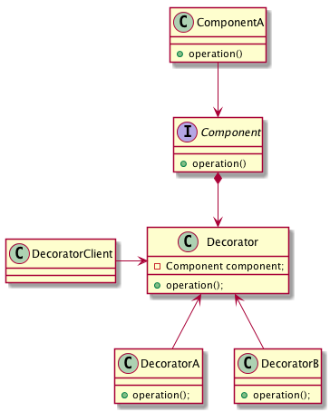

= 4- decorator Pattern
decorator 模式实际上增加了一个decorator的实现来增强原来对象的实现

== 4.1 关于装饰器的一个示意图

== 4.2 装饰器的实现
:sourcedir: ../../dp-demos/src/main/java

[source,java]

.Component
----
include::{sourcedir}/io/hedwig/dp/demos/structural/decorator/Component.java[]
----

.ComponentA
----
include::{sourcedir}/io/hedwig/dp/demos/structural/decorator/ComponentA.java[]
----

.Decorator
----
include::{sourcedir}/io/hedwig/dp/demos/structural/decorator/Decorator.java[]
----

.DecoratorA
----
include::{sourcedir}/io/hedwig/dp/demos/structural/decorator/DecoratorA.java[]
----

.DecoratorB
----
include::{sourcedir}/io/hedwig/dp/demos/structural/decorator/DecoratorB.java[]
----

.DecoratorClien
----
include::{sourcedir}/io/hedwig/dp/demos/structural/decorator/DecoratorClien.java[]
----
