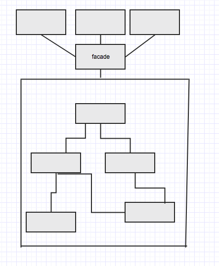

= 5- facade Pattern
引入一个统一的外观角色来处理和外部客户端的交互，客户端不需要了解整个系统的内部实现只需要和facade打交道就可以。
同样由于客户端几乎都和facade大交道，那么灵活性相对来说不太够，主要是底层颗粒度比较细的功能无法直接调用

== 5.1 关于外观的一个示意图

== 5.2 外观的实现

:sourcedir: ../../dp-demos/src/main/java
[source,java]

.Facade
----
include::{sourcedir}/io/hedwig/dp/demos/structural/facade/Facade.java[]
----

.FacadeClient
----
include::{sourcedir}/io/hedwig/dp/demos/structural/facade/FacadeClient.java[]
----

.SubSysA
----
include::{sourcedir}/io/hedwig/dp/demos/structural/facade/SubSysA.java[]
----

.SubSysAB
----
include::{sourcedir}/io/hedwig/dp/demos/structural/facade/SubSysAB.java[]
----

.SubSysB
----
include::{sourcedir}/io/hedwig/dp/demos/structural/facade/SubSysB.java[]
----

.SubSys
----
include::{sourcedir}/io/hedwig/dp/demos/structural/facade/SubSys.java[]
----
